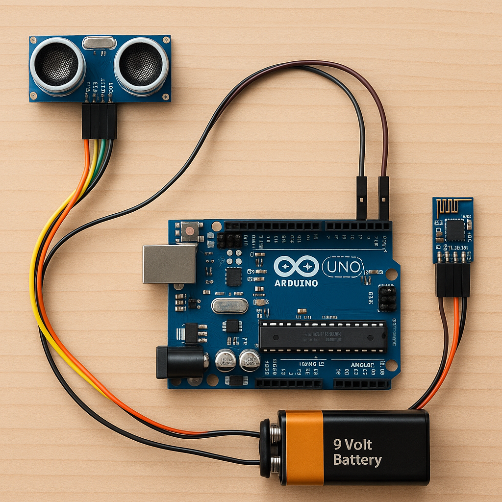

# 💧 Smart Drain Clearance System 🚛
**By: Deiva Lakshmee**

This is a mini-project that introduces an automated, sensor-based drainage monitoring and clearance system. It uses a Raspberry Pi with an ultrasonic sensor to detect sewage levels, alert a centralized system, auto-assign workers, and send SMS-based payment links to users.

---

## 📌 Features

- Real-time sewage level monitoring
- Automated notification to the Smart Drain Clearance Company
- Lorry and worker auto-scheduling
- SMS alerts with secure bill payment link
- Automatic transaction and worker salary logging

---

## 🛠️ Hardware Requirements

- Raspberry Pi (any GPIO-supported model)
- Ultrasonic Sensor (HC-SR04)
- Breadboard & Jumper wires
- Power Supply
- Wi-Fi module (built-in in Pi 3/4)

---

## 💻 Software Requirements

- Python 3
- Raspbian OS
- RPi.GPIO Python Library
- IDE: Thonny / VS Code / Terminal

---

## 🧠 How It Works

1. Ultrasonic sensor checks tank level.
2. If level exceeds threshold, signal sent to company.
3. Server identifies nearest lorry and available worker.
4. After clearing, customer receives SMS with payment link.
5. Payment is completed and logged automatically.
6. Worker salary is credited based on job count.

---

## 🗂️ Project Files

- `ultrasonic_sensor_code.py`: Python code to measure sewage level
- `report.pdf`: Complete documentation of the project
- `architecture_diagram.png`: System flow and data handling
- `hardware_diagram1.png`: Sensor wiring diagram
- `hardware_diagram2.png`: Raspberry Pi GPIO pinout

---

## 🔍 Sample Code

```python
import RPi.GPIO as GPIO
import time

GPIO.setmode(GPIO.BCM)
TRIG = 9
ECHO = 10
GPIO.setup(TRIG, GPIO.OUT)
GPIO.setup(ECHO, GPIO.IN)

def measure_distance():
    GPIO.output(TRIG, False)
    time.sleep(2)
    GPIO.output(TRIG, True)
    time.sleep(0.00001)
    GPIO.output(TRIG, False)

    while GPIO.input(ECHO) == 0:
        pulse_start = time.time()

    while GPIO.input(ECHO) == 1:
        pulse_end = time.time()

    pulse_duration = pulse_end - pulse_start
    distance = pulse_duration * 17150
    distance = round(distance, 2)
    return distance

try:
    while True:
        dist = measure_distance()
        print("Distance:", dist, "cm")
        if dist < 10:
            print("Drainage block detected! Overflow risk!")
        time.sleep(5)

except KeyboardInterrupt:
    GPIO.cleanup()

### 📊 Project Diagrams

#### 🖼️ Sensor Setup Diagram  
This shows how the ultrasonic sensor is connected to the Raspberry Pi to measure sewage levels.



#### 🛠️ System Architecture Diagram  
Illustrates the working model and how all components communicate in the Smart Drain Clearance System.


